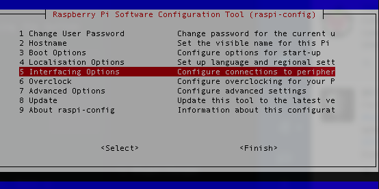

# Weather Station software installation

## Introduction

The Weather Station software has two main elements. The first is the collection of drivers and scripts that are needed to communicate with the various weather sensors. The second is the local MariaDB database that is used to store all the data produced by the sensors. This data is regularly uploaded to our online Oracle database so that it can be analysed and compared with all the other Weather Stations from around the world.

Before continuing, please ensure that you have [registered your School and Weather Station on the Oracle database](register.md).

The entire software installation process can take a while, especially if you have a slow Internet connection. If you're planning to carry out the installation as part of a lesson or club, it is probably a good idea to download everything you need (especially SD card images), burn the SD card and perform any software updates **before** the session.

There are three ways to install the software. Each has its advantages and disadvantages. We recommend that you read through each method before deciding which one is best for you.

## Method 1: Pre-built SD card image

In some ways this is the easiest method, however there are some disadvantages:
- The image will not be updated for every new Raspbian release so the update/upgrade process (step 2) may take longer.
- Any hardware problems may be much harder to diagnose. Using either of the other methods is much more likely to reveal individual errors and make them simpler to correct. If you contact Weather Station support with problems having used the pre-built image, you will probably be asked to try again using the more manual methods.
- The image is intended to be run on a Raspberry Pi 2 (the model that shipped with the kit) or a Pi 3. If you're using something else (an older Pi or a Pi Zero), it will not work without some tinkering.
- The image is based on the stripped-down 'lite' build of Raspbian. Therefore it does not have any graphical software such as LibreOffice installed and all configuration (e.g. connecting to a wifi network) will have to be performed using the command line and by editing text files.  

To use the image, do the following:

1. Download the [Weather Station image](https://downloads.raspberrypi.org/weather_station/images/weather_station-2016-03-24/) and [burn it](https://www.raspberrypi.org/learning/software-guide/) to your SD card.

1. Connect the Pi to the Internet. Login with the standard username and password (pi/raspberry) and run

    ```bash
    sudo sudo apt-get update && sudo apt-get upgrade -y
    ```
1. Modify the **credentials.oracle** file in the weather-station directory and replace ‘*blank*’s with your Oracle database Weather Station name and passcode.

1. In order to ensure that you don't rapidly run out of disk space, run:
    ```bash
    sudo raspi-config
    ```
    

1. Then select 'Advanced Options' followed by 'Expand Filesystem'.

    

1. Make sure all the sensors are connected and begin the [testing procedures](https://github.com/topshed/weather-station-guide/blob/master/test.md).

## Method 2: One-line installer

### Getting the latest Raspberry Pi OS

1. The SD card that was originally shipped with the Weather Station kit contains a version of Raspbian, the Raspberry Pi operating system, which is now extremely out of date and should not be used.

1. Follow the [guide on the Raspberry Pi website](https://www.raspberrypi.org/learning/software-guide/) which tells you how to install the latest version of Raspbian. You can use the full Desktop version or the slimmer 'Lite' one. The latter is a smaller download as it does *not* include LibreOffice, Wolfram and many other packages which are not required for operation of the Weather Station. However, it is command-line only, and therefore all configuration is performed through this interface. There is no GUI.  

### Setting up the Weather Station software.

1. When Raspbian boots up, press **Ctrl** and **Alt** and the character **t** on your keyboard. This will open up a Terminal window. [Desktop Raspbian only]

1. Type

    ```bash
    sudo raspi-config
    ```

    

1. Now enable [Secure Shell access](https://www.raspberrypi.org/blog/ssh-shenanigans/) from the "Interfacing Options" menu. This will allow you to remotely login to your Pi via the network. In this way you can work on your Pi Weather Station without having a monitor, keyboard and mouse attached.


    


1. Now run the one-line installer.  Type (or copy and paste) the following line into the terminal window.

	```bash
	curl -L http://rpf.io/wsinstall | bash
	```

1. You can now proceed through the installation process. When prompted, press **y** to continue.

    

1. The first part of the installation is to update any packages that may have been upgraded by their developers since the Raspbian image was built. Note that sometimes during the `update` and `upgrade` process you may be prompted as to whether you would like certain pieces of software to be installed or certain settings to be changed.
It is normally fine to accept the default answer, but always read the request carefully.

1. The Real Time Clock (RTC) is configured next. If the time displayed is correct, type **y** as prompted.

    

1. If the time is *incorrect*, type **n** and then enter the correct time in the format `yyyy-mm-dd hh:mm:ss`.

    

1.  Next you will need to choose a database password. It can be anything you like, as it is the password for the local MariaDB database on your Raspberry Pi. Write the password down somewhere so you do not forget it.

    

1. The MariaDB packages will now be installed. This will provide the local database on your Pi for storing your weather data.

1. Next you need to type in the Weather Station name and password/key that you obtained when you [registered](https://www.raspberrypi.org/learning/weather-station-guide/register.md) your Weather Station with the online Oracle database.

    

1. That's it. Once the install has finished, your Raspberry Pi should reboot.

## Method 3: Manual step-by-step installation

1. Although the simplest way to perform the software installation process is to use our one-line install script, the benefit of setting it up manually is that you'll learn about the workings of the sensors and the station as you do it. If you wish to proceed manually through the steps, then you can follow [this guide](manual-setup.md). Note that this is only recommended if you're happy using the command line interface, or want to make custom adjustments to your setup.

## What next?

You can now proceed to finishing the hardware setup with our [hardware guide](build2.md), or move on to testing the sensors with our [testing guide](test.md) if you've already finished the assembly.
